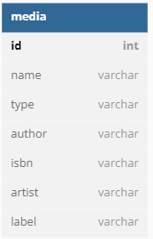

# Subclass Entities

By default, Quick supports basic component-level inheritance of entities, meaning that a child component inherits the properties ( and ability to overload ) its parent. A common, object-oriented relational database pattern, however is to provide additional definition on parent tables ( and classes ) within child tables which contain a foreign key.

Quick supports two types of child classes: Discriminated and Subclassed child entities. In both cases, loading any child class will also deliver the data of its parent class.

## Subclass Entities

Let's say, for example, that I have a `Media` entity, which is used to catalog and organize all media items loaded in to my application.

```javascript
component 
    table="media" 
    extends="quick.models.BaseEntity" 
    accessors="true"
{

    property name="id";
    property name="uploadFileName";
    property name="fileLocation";
    property name="fileSizeBytes";

}
```

My `Media` entity contains all of the properties which are common to every media item uploaded in to my application. Let's say, however, that I need to have specific attributes that are available on only media for my `Book` entity ( e.g. whether the image is the cover photo, for example ). I can create a child class of `BookMedia` which extends my `Media` entity. When loaded, all of the properties of `Media` will be loaded along with the custom attributes which apply to my `BookMedia` object:

```javascript
component
    extends="Media"
    table="book_media"
    joinColumn="FK_media"
    accessors="true"
{
    property name="displayOrder";
    property name="designation";

    function approvalStatus(){
        return belongsTo( "Book", "FK_book" );
    }

}
```

Note the additional component attribute `joincolumn`. The presence of this attribute on a child class signifies that it is a child entity of the parent and that the parent's properties should be loaded whenever the `BookMedia` entity is loaded. In addition, the primary key of the entity is that of the parent.


Note that a `table` attribute is required on a child entity if the parent entity has one.  This is because ColdBox will perform a deep merge on the entire inheritance chain for metadata properties.  If a parent class has a `table` attribute, it will show up as the child's `table` attribute.


Child entities can be retrieved by queries specific to their own properties:

```javascript
var coverPhotos = getInstance( "BookMedia" )
                    .where( "designation", "cover" )
                    .orderBy( "displayOrder", "ASC" );
```

Or properties on the parent class can be used as first-class properties within the query:

```javascript
var smallCoverPhotos = getInstance( "BookMedia" )
                    .where( "designation", "cover" )
                    .where( "fileSizeBytes", "<", 40000 )
                    .orderBy( "displayOrder", "ASC" )
                    .orderBy( "uploadFileName", "ASC" );
```

Child entities can be retrieved, individually, using the value of the `joinColumn`, which should be a foreign key to the parent identifier column:

```javascript
var myBookMediaItem = getInstance( "BookMedia" ).get( myId );
```

Now my `Book` entity can use its extended media class to retrieve media items which are specific to its own purpose:

```javascript
function media(){
    return hasMany( "BookMedia", "FK_book" ).orderBy( "displayOrder", "ASC" );
}
```

## Discriminated Entities

A discriminated child class functions, basically, in the same way as a subclassed entity, with one exception: The parent entity is aware of the discriminated child due to a `discriminatorValue` attribute and will return a specific subclass when a retrieval is performed through the parent Entity. This pattern is also known as polymorphic association.

Quick supports two different types of discriminated entities defined by single-table inheritance (STI) or multi-table inheritance (MTI). Your database schema will determine the most appropriate inheritance pattern for your use case.

Let's take our `BookMedia` class again, but this time, define it as a discriminated entity.

The first step is to add the `discriminatorColumn` attribute to the `Media` entity, which is used to differentiate the subclass entities. Next, define an array of possible discriminated entities for the parent.  This is so we don't have to scan all Quick components just to determine if there are any discriminated entities.

Then we set a `discriminatorValue` property on the child class, the value of which is stored in the parent entity table, which differentiates the different subclasses.

```javascript
// Media (parent entity)
component 
    extends="quick.models.BaseEntity" 
    accessors="true"
    table="media" 
    discriminatorColumn="type" // the database column that determines the subclass
{

    property name="id";
    property name="uploadFileName";
    property name="fileLocation";
    property name="fileSizeBytes";
    
    // Array of all possible subclass entities
    variables._discriminators = [
        "BookMedia"
    ];

}
```

Then we set a `discriminatorValue` property on the child class, the value of which is stored in the parent entity table:

```javascript
// BookMedia (subclass)
component
    extends="Media"
    accessors="true"
    discriminatorValue="book" // column value unique to this subclass
{
    property name="displayOrder";
    property name="designation";

}
```

We aren’t entirely done yet. Finally, we must tell Quick whether we are using multi-table inheritance or single-table inheritance so it can map the database data to the subclass entities.

### Multi-Table Inheritance (MTI)

If the data for your discriminated entities is normalized across multiple tables, you should use the multi-table inheritance (MTI) method for creating discriminated entities. In the example below, The `Media` entity has two subclasses, `MediaBook` and `MediaAlbum`. The discriminator column for the entities is the `type` column in the `media` table and the distinct properties for each subclass come from the `media_book` and `media_album` tables.



To inform Quick that our database schema follows the MTI pattern, we must add a `joinColumn` and `table` values for _each subclass_.

```javascript
// BookMedia (subclass entity using MTI)
component 
    extends="Media"
    table="media_book" // table for BookMedia data
    joinColumn="mediaId" // column to join on
    accessors="true"
{
```

### Single Table Inheritance (STI)

If the data for your discriminated entities lives in a single table, you should use the single-table inheritance (STI) method for creating discriminated entities. In the example below, the `Media` entity has two subclasses, `MediaBook` and `MediaAlbum`. The discriminator column for the entities is the `type` column in the `media` table, and the distinct properties for each subclass come from a single table.

.png>)

To inform Quick that our database schema follows the STI pattern, we must also add `singleTableInheritance=true` to the _parent_ entity.&#x20;

```
// Media (parent entity)
component 
    extends="quick.models.BaseEntity" 
    accessors="true"
    table="media" 
    discriminatorColumn="type" 
    singleTableInheritance="true" // Enable STI
{
```

### Retrieving Discriminated Entities

Once the parent and child entities are defined, new `BookMedia` entities will be saved with a type value of "book" in the `media` table. As such, the following query will result in only entities of `BookMedia` being returned:

```javascript
var bookMedia = getInstance( "Media" ).where( "type", "book" ).get();
```

If our Media table contains a combination of non-book and book media, then the collection returned when querying all records will contain a mix of `Media` entities such as `BookMedia` and `AlbumMedia`

```javascript
var allMedia = getInstance( "Media" ).all();
```

If you want to create a brand-new entity of a specific subclass, you can do so by calling `newChildEntity( discriminatorValue )` like this:

```javascript
var newBookMedia = getInstance( "Media" ).newChildEntity( "BookMedia" );
```

## Summary

Discriminated and child class entities, allow for a more Object oriented approach to entity-specific relationships by allowing you to eliminate pivot/join tables and extend the attributes of the base class.
